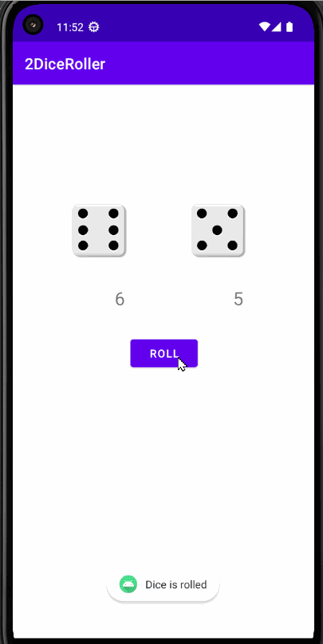

# 2DiceRoller-App

Code for Android Basics Codelab.

Introduction
------------
2Dice Roller is a game where you roll two dice simultaneously by pressing the roll button, and then the outcomes are displayed below the dice. This app is specifically designed for educational purposes in the course to explore the Android lifecycle and log messages to the Android console, known as Logcat. It provides hands-on experience with Android app development and demonstrates concepts such as user interaction, random number generation, and UI updates.

Pre-requisites
--------------

You need to know:
- How to open, build, and run apps with Android Studio.
- What an activity is, and how to create one in your app.
- What the activity's onCreate() method does, and the kind of operations
  that are performed in that method.

Getting Started
---------------

1. Download and run the app.

Demo of App
---------------

## Author

- [Raban Kathariya](https://www.github.com/raban2)
